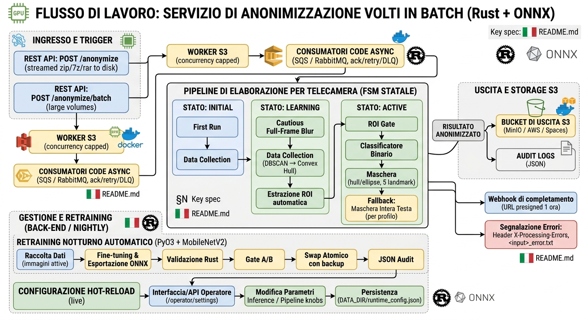

# Anonimizzazione Volti

<p align="center">
  
</p>

<p align="center">
  <a href="https://github.com/oraziog/anonimizzazione_volti/actions/workflows/ci.yml"></a>
  
  <a href="INSTALLAZIONE.md"></a>
</p>

Servizio batch di anonimizzazione facciale (Rust + ONNX) per telecamere fisse
ZTL/traffico, orientato alla conformità GDPR: **zero volti reali visibilmente
non offuscati in uscita**, precisione chirurgica tramite classificatore binario
e apprendimento automatico del ROI per telecamera.

<p align="center">
  
</p>

Il design rationale è espresso nei sorgenti come commenti `spec §N`; il
documento di specifica associato era un artefatto di start-up e non è più
incluso nel repository. Il riferimento operativo completo è
in `src/README.md`.

## Cosa fa

- **Ingest batch** — `POST /anonymize` (zip/7z/rar, streaming su disco, mai in
  RAM), `/anonymize/batch` per volumi oltre `BODY_LIMIT_BYTES`.
- **Pipeline a stati per telecamera (FSM)** — `INITIAL` → `LEARNING` → `ACTIVE`:
  sfocatura full-frame cautelativa, raccolta dati, estrazione **ROI** (DBSCAN →
  hull convesso), gate ROI + **classificatore binario** + maschera hull/ellisse
  dei 5 landmark facciali, fallback "head" per profili puri.
- **Identità della camera** — dal **numero di serie EXIF** del frame
  (`CAMERA_ID_SOURCE=exif`, tag BodySerialNumber) con fallback automatico
  sull'identità ricavata dal nome file.
- **Autoapprendimento notturno** — retraining PyO3 (MobileNetV2: seed + falsi
  positivi), export ONNX, validazione Rust-side, gate A/B, swap atomico con
  backup, audit JSON consultabile dall'operatore; il modello swappato
  **sopravvive ai riavvii** (ripristino automatico dallo stato persistito
  all'avvio).
- **Store S3** — backend di ingest asincrono da bucket S3-compatibili
  (MinIO / AWS / Spaces): job intake, output su bucket, audit log JSON,
  **webhook di completamento con URL presigned (1 h)**, sweep operator batch,
  soglia di concorrenza `S3_MAX_CONCURRENT_JOBS`. Feature cargo `s3`
  (vedi `src/docker-compose.minio.yml`).
- **Code asincrone** — consumer **SQS** e **RabbitMQ** (feature `queue` /
  `rabbitmq`) sullo stesso worker S3: ack su successo, retry esponenziale e DLQ.
- **Header X-Processing-Errors** + `<input>_error.txt` per report per-file.
- **Hot-reload dei parametri runtime** — soglie di inferenza, modalità di
  anonimizzazione e altri knob della pipeline sono modificabili a caldo tramite
  la UI/API operatore `/operator/settings` (persistiti in
  `DATA_DIR/runtime_config.json`, senza riavvio).
- **GPU** — provider ONNX Runtime `cpu | cuda | tensorrt | directml`
  (feature cargo + `Dockerfile.gpu`), fail-fast se la GPU configurata non è
  utilizzabile.

## Documentazione

| Documento | Contenuto |
| --- | --- |
| [`INSTALLAZIONE.md`](INSTALLAZIONE.md) | **Manuale di installazione e messa in servizio su Windows** — prerequisiti, build, configurazione, FSM delle cam, strumenti operativi e diario delle difficoltà reali con le soluzioni |
| [`INSTALLATION.md`](INSTALLATION.md) | Versione inglese del manuale di installazione |
| [`ATTIVA-RETRAINING.md`](ATTIVA-RETRAINING.md) | Stato del retraining notturno, diagnostica PyO3/ONNX e note Docker |
| [`src/README.md`](src/README.md) | Riferimento operativo completo: architettura, API, configurazione, S3, code, tuning |

## Avvio rapido (Windows nativo)

Prerequisiti e build dettagliati in [INSTALLAZIONE.md](INSTALLAZIONE.md); in
sintesi:

```powershell
# 1) build (dalla root del repo)
cargo build --release --manifest-path src/Cargo.toml

# 2) configurazione: copia src/.env.example in src/.env e personalizza
#    (OPERATOR_API_KEY, percorsi, CRON_RETRAIN_SCHEDULE, ...)

# 3) avvio con un doppio click: start-server.cmd (carica il .env, lancia
#    l'exe, log su logs\server.log)

# 4) verifica
curl http://localhost:8080/health
```

Il primo avvio scarica i modelli ONNX (YOLO) in `models_cache/`; le cam
partono in `INITIAL`/`LEARNING` e sfocano tutto il frame finché la FSM non
attiva la ROI. Il retraining notturno (richiede Python 3.11/3.12 + torch,
vedi INSTALLAZIONE.md) raffina il classificatore con i falsi positivi
raccolti; il modello validato viene scambiato a caldo e sopravvive ai
riavvii.

## Struttura

| Percorso | Contenuto |
| --- | --- |
| `src/` | Crate Rust (build `cargo build --release` dentro `src/`) |
| `src/README.md` | Documentazione completa: architettura, API, configurazione, S3, code, tuning misurato |
| `src/docker-compose.yml` | Stack completo con retraining notturno |
| `src/docker-compose.minio.yml` | Stack + MinIO + backend S3 (feature `s3`) |
| `src/docker-compose.gpu.yml` | Stack con ONNX Runtime CUDA (feature `cuda`) |
| `src/python/` | `retrain.py` (retraining notturno), `prepare_seed.py` (seed del classificatore) |
| `src/scripts/` | Harness di test/esplorazione (`test-wider.ps1`, `eval_wider_output.py`, `blur_compare.py`, …) |
| root: `start-server.cmd`, `report-camere.ps1`, `alert-retraining.ps1`, … | Strumenti operativi Windows: avvio/stop, report giornaliero e settimanale, alert retraining, rotazione log, validazione classificatore |
| `models_cache/` | Modelli ONNX scaricati a runtime (ignorati da git, vedi `.gitignore`) |

## Avvio rapido (backend S3 con MinIO)

```bash
cd src
cp .env.example .env    # impostare S3_ENABLED=true + credenziali
docker compose -f docker-compose.minio.yml up -d --build

./scripts/s3_tools.sh upload frame.zip camera_001.zip   # -> bucket input
curl -X POST localhost:8080/anonymize/s3 \
     -H 'Content-Type: application/json' \
     -d '{"input_key":"camera_001.zip"}'
curl localhost:8080/status/<JOB_ID>
```

Flow S3: scarica l'archivio dal bucket input → stessa `ZipProcessor` del path
HTTP → upload `elaborati/<stem>_elaborato.zip` sul bucket output → audit log
JSON sul bucket logs → webhook facoltativo con URL presigned. In caso di
errore l'oggetto in ingresso viene spostato sotto `errori/` nel bucket input
(nessun re-pick da parte dei sweep). Dettaglio completo nel README di `src/`.

## Licenza dei dati

Il sistema **non genera** il seed del classificatore: è esterno/mountato
(`dataset_seed/real_faces`); `src/python/prepare_seed.py` lo costruisce da un
dataset YOLO o da WIDER FACE (verificare la licenza delle immagini prima
dell'uso in produzione). `dataset_falsi_positivi/`, `dataset_seed/`,
`.test-assets/` e i modelli ridimensionati sono esclusi dal repository.

---

# Anonimizzazione Volti — README (English)

<p align="center">
  
</p>

<p align="center">
  <a href="https://github.com/oraziog/anonimizzazione_volti/actions/workflows/ci.yml"></a>
  
  <a href="INSTALLATION.md"></a>
</p>

Batch face-anonymization service (Rust + ONNX) for fixed traffic/ZTL cameras,
designed for GDPR compliance: **zero visibly-unblurred real faces in the
output**, surgical precision via a binary classifier, and automatic per-camera
region-of-interest (ROI) learning.

<p align="center">
  
</p>

Design rationale is captured throughout the source as `spec §N` comments;
the original specification document was an internal startup artifact and is no
longer shipped with the repository. The full operational reference lives in
`src/README.md`.

## What it does

- **Batch ingest** — `POST /anonymize` (zip/7z/rar, streamed to disk, never
  buffered in RAM), `/anonymize/batch` for volumes beyond `BODY_LIMIT_BYTES`.
- **Per-camera stateful pipeline (FSM)** — `INITIAL` → `LEARNING` → `ACTIVE`:
  cautious full-frame blur, data collection, **ROI extraction** (DBSCAN →
  convex hull), ROI gate + **binary classifier** + hull/ellipse mask of the
  5 facial landmarks, "head" fallback for pure-profile shots.
- **Camera identity** — from the **EXIF body serial number** of the frame
  (`CAMERA_ID_SOURCE=exif`, BodySerialNumber tag) with automatic fallback to
  the filename-derived identity.
- **Nightly self-retraining** — PyO3 fine-tuning (MobileNetV2: seed + false
  positives), ONNX export, Rust-side validation, A/B gate, atomic swap with
  backup, operator-visible JSON audit; the swapped model **survives
  restarts** (restored automatically from persisted state at startup).
- **S3 storage backend** — asynchronous job intake from S3-compatible buckets
  (MinIO / AWS / Spaces): job submission, output to a bucket, JSON audit logs,
  **completion webhook with a 1-hour presigned URL**, operator batch sweep,
  concurrency capped by `S3_MAX_CONCURRENT_JOBS`. Cargo feature `s3` (see
  `src/docker-compose.minio.yml`).
- **Async queues** — **SQS** and **RabbitMQ** consumers (features `queue` /
  `rabbitmq`) driving the same S3 worker: ack on success, exponential retry,
  DLQ.
- **X-Processing-Errors header** + `<input>_error.txt` for per-file error
  reporting.
- **Hot-reload runtime parameters** — inference thresholds, anonymization mode
  and other pipeline knobs can be changed live (no restart) via the operator
  UI/API at `/operator/settings`, persisted to `DATA_DIR/runtime_config.json`.
- **GPU** — ONNX Runtime providers `cpu | cuda | tensorrt | directml`
  (cargo feature + `Dockerfile.gpu`), fail-fast when the configured GPU is
  unusable.

## Documentation

| Document | Contents |
| --- | --- |
| [`INSTALLATION.md`](INSTALLATION.md) | **Windows installation and commissioning manual** — prerequisites, build, configuration, camera FSM, operator tooling, and a field log of real pitfalls with their fixes |
| [`INSTALLAZIONE.md`](INSTALLAZIONE.md) | Italian version of the installation manual |
| [`ATTIVA-RETRAINING.md`](ATTIVA-RETRAINING.md) | Nightly retraining status, PyO3/ONNX diagnostics and Docker notes |
| [`src/README.md`](src/README.md) | Full operational reference: architecture, API, config, S3, queues, tuning |

## Quick start (native Windows)

Prerequisites and the full build walkthrough are in
[INSTALLATION.md](INSTALLATION.md); in short:

```powershell
# 1) build (from the repo root)
cargo build --release --manifest-path src/Cargo.toml

# 2) configuration: copy src/.env.example to src/.env and customize
#    (OPERATOR_API_KEY, paths, CRON_RETRAIN_SCHEDULE, ...)

# 3) one double-click to run: start-server.cmd (loads the .env, launches
#    the exe, logs to logs\server.log)

# 4) verify
curl http://localhost:8080/health
```

The first start downloads the ONNX models (YOLO) into `models_cache/`;
cameras start in `INITIAL`/`LEARNING` and blur the whole frame until the FSM
activates the ROI. Nightly retraining (needs Python 3.11/3.12 + torch, see
INSTALLATION.md) refines the classifier with the collected false positives;
the validated model is hot-swapped and survives restarts.

## Repository layout

| Path | Contents |
| --- | --- |
| `src/` | Rust crate (build `cargo build --release` inside `src/`) |
| `src/README.md` | Full documentation: architecture, API, config, S3, queues, measured tuning |
| `src/docker-compose.yml` | Full stack with nightly retraining |
| `src/docker-compose.minio.yml` | Stack + MinIO + S3 backend (feature `s3`) |
| `src/docker-compose.gpu.yml` | Stack with ONNX Runtime CUDA (feature `cuda`) |
| `src/python/` | `retrain.py` (nightly retraining), `prepare_seed.py` (classifier seed) |
| `src/scripts/` | Test/exploration harnesses (`test-wider.ps1`, `eval_wider_output.py`, `blur_compare.py`, …) |
| root: `start-server.cmd`, `report-camere.ps1`, `alert-retraining.ps1`, … | Windows operator tooling: start/stop, daily and weekly reports, retraining alerts, log rotation, classifier validation |
| `models_cache/` | ONNX models downloaded at runtime (git-ignored, see `.gitignore`) |

## Quick start (S3 backend with MinIO)

```bash
cd src
cp .env.example .env    # set S3_ENABLED=true + credentials
docker compose -f docker-compose.minio.yml up -d --build

./scripts/s3_tools.sh upload frame.zip camera_001.zip   # -> input bucket
curl -X POST localhost:8080/anonymize/s3 \
     -H 'Content-Type: application/json' \
     -d '{"input_key":"camera_001.zip"}'
curl localhost:8080/status/<JOB_ID>
```

S3 flow: downloads the archive from the input bucket → same `ZipProcessor` as
the HTTP path → uploads `elaborati/<stem>_elaborato.zip` to the output bucket →
writes a JSON audit log to the logs bucket → optional webhook with a presigned
URL. On failure the input object is **moved** under `errori/` in the input
bucket (so sweeps never re-pick it). Full details in `src/README.md`.

## Data licensing

The system **never generates** the classifier seed: it is external/mounted
(`dataset_seed/real_faces`); `src/python/prepare_seed.py` builds it from a YOLO
dataset or WIDER FACE (check the license of the images before shipping them
into a production model). `dataset_falsi_positivi/`, `dataset_seed/`,
`.test-assets/` and downloaded models are excluded from the repository.