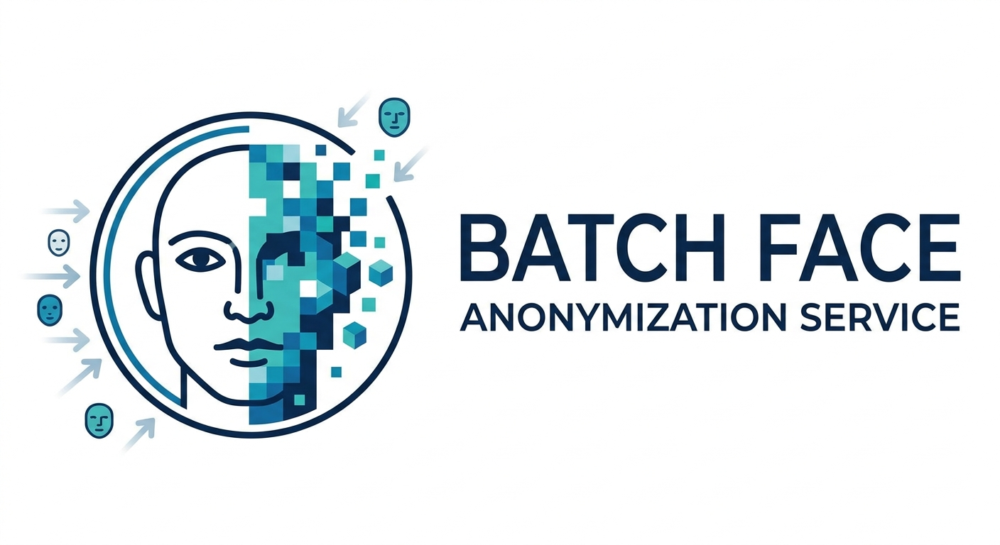

# Anonimizzazione Volti — batch face-anonymization service (Rust + ONNX)

<p align="center">
  
</p>

Industrial-grade microservice that anonymizes (blurs) faces in batches of images
captured by fixed traffic/ZTL cameras, targeting GDPR compliance: **zero
visibly-unblurred real faces in the output**, surgical precision via a binary
classifier, and automated ROI learning per camera.

The design rationale is captured throughout the source as `spec §N`
comments; the associated specification document was an internal startup
artifact and is no longer shipped with the repository.

## Architecture

| Module | Responsibility (spec) |
| ------ | --------------------- |
| `src/main.rs` | Runtime model download + fail-fast, SQLite pool, Axum server, operator endpoints, nightly ROI/retraining scheduler |
| `src/models.rs` | ONNX session pooling (per-worker exclusive sessions), YOLOv8-Face DFL/keypoint decoding, binary classifier preprocessing |
| `src/model_loader.rs` | Runtime download with backoff, SHA-256 verification, on-disk cache, loadability checks |
| `src/zip_worker.rs` | In-memory ZIP ingestion, robust `CAM_001/…`/`CAM_001_…` camera parser, bounded concurrency, `Stored`-compression output ZIP, FP-crop persistence |
| `src/pipeline.rs` | FSM-conditional anonymization: INITIAL full-frame blur, LEARNING box blur + data collection, ACTIVE ROI gate + classifier + hull/ellipse masked blur |
| `src/roi.rs` | DBSCAN → outlier rejection → convex hull → RDP smoothing → geometric validation → safety margin |
| `src/db.rs` | SQLite (WAL): camera FSM persistence, detection coordinates, ROI polygons, frame geometry |
| `src/config.rs` | Centralized env-var configuration (fail-fast on invalid values) |
| `src/training.rs` + `python/retrain.py` | Optional nightly PyO3 retraining bridge: fine-tune + ONNX export + pre-swap validation + backup + JSON audit |
| `src/eval_wider.rs` / `src/eval_fddb.rs` | Offline CLI evaluation of the detector against WIDER FACE / FDDB ground truth (AP, precision/recall, recall vs FP-per-image) |
| `python/prepare_seed.py` | Classifier-seed builder: crops face boxes from a YOLO dataset or from WIDER FACE (difficulty-filtered) |

### Session model (important)

`ort` 2.0 `Session::run` requires `&mut self` — ONNX Runtime sessions are **not
safe for concurrent inference** (per the `ort` docs). Instead of sharing one
`ArcSwap<Session>`, concurrent image workers each get an *exclusive* session
from a `SessionPool` (bounded by the §9 concurrency semaphore, one live session
per busy worker). The classifier is hot-swapped after nightly retraining by
atomically replacing the *whole pool* with one pointing at the new ONNX file;
in-flight workers finish on the old sessions.

### Camera FSM (spec §4)

- `INITIAL` — camera unknown or operator-reset; cautious **full-frame** blur,
  then an immediate transition to `LEARNING`.
- `LEARNING` — YOLO box + 15% margin blur (`σ = box_width/8`, clamped `[5,50]`);
  detection centers are persisted to SQLite and dubious crops
  (`conf < FP_CROP_CONF_MAX`) are saved to
  `dataset_falsi_positivi/{camera_id}/` for retraining. After
  `LEARNING_DAYS` the nightly task extracts a ROI and activates the camera.
- `ACTIVE` — only detections whose center falls inside the persisted ROI are
  blurred; the binary classifier re-checks the crop (fail-safe: classifier
  errors blur anyway), and the blur region is the **convex hull of the 5 facial
  keypoints** (ellipse fallback when the loaded model exports no landmarks),
  masked + gaussian-softened, margin `BLUR_HULL_MARGIN_PCT`.
- **Head fallback** (`HEAD_FALLBACK_ENABLED`) — when the face detector finds no
  faces in an ACTIVE frame (typical for pure-profile or heavily occluded
  shots), a COCO person detector runs and the **upper `HEAD_FALLBACK_FRACTION`
  of every person box** (the head region) is blurred. It is a
  privacy-preserving last resort: blurring a head silhouette is safer than
  leaving a face unblurred.

### ROI extraction (spec §5)

Nightly task (and one catch-up pass at boot): for each `LEARNING` camera whose
window elapsed — DBSCAN (`eps`/`min_samples`) → drop unclustered noise →
convex hull → RDP smoothing → geometric validation (polygon area must be
10–90% of the frame) → centroid expansion by `ROI_MARGIN_PCT`. Success moves the
camera to `ACTIVE`; failure keeps it in `LEARNING` (anomaly logged for manual
review, spec §5.6).

## Build & run

### Local (no retraining)

```bash
cargo build --release
cargo test
```

Set the operational env vars from `.env.example`:

```bash
cp .env.example .env      # then edit paths / thresholds
export $(grep -v '^#' .env | xargs)   # or use your preferred loader
cargo run --release
```

The YOLO face model is downloaded automatically at startup to
`MODEL_CACHE_DIR` and verified against `MODEL_YOLO_SHA256` (default:
`yolov8m-face-lindevs.onnx`, a WIDERFace-trained model with hard-set mAP
≈84.6 vs ≈79.4 for the nano — measurably better recall on profiles and small
faces; `YOLO_MODEL_URL` swaps in any YOLOv8-Face export). When
`HEAD_FALLBACK_ENABLED=true`, the COCO person detector (`COCO_MODEL_URL`) is
also downloaded for the head-fallback path. **Startup fails fast** if a
configured model cannot be downloaded or loaded (spec §3).

### Docker (recommended — full service with nightly retraining)

```bash
docker compose up -d --build
```

The image build enables the `retraining` cargo feature (PyO3, Python 3.11) and
installs CPU PyTorch; set a real `OPERATOR_API_KEY` in `.env` first.

### GPU (NVIDIA CUDA) via Docker

A separate image compiles the binary with the `cuda` cargo feature (ort's
`download-binaries` then fetches a **CUDA 13 + cuDNN 9** ONNX Runtime) and
deploys on the GUI driver stack:

```bash
docker compose -f docker-compose.gpu.yml up -d --build
```

Set `ORT_EXECUTION_PROVIDER=cuda` in `.env` (the compose file defaults it
too), calibrate `ORT_CUDA_DEVICE_ID` / `ORT_CUDA_MEMORY_LIMIT_BYTES`, and
make sure the `nvidia/cuda:*` base tag in `Dockerfile.gpu` matches the host
driver (verify inside the container with `ldd` and `nvidia-smi`). Local
Windows builds with a GPU feature also work (`cargo build --features cuda`)
but the process needs the same CUDA/cuDNN runtime DLLs at execution time.

### Retraining build requirements

`cargo build` uses no default features, so a plain toolchain suffices. To build
the retraining bridge locally you need Python **3.11 or 3.12** with headers
(`python3-dev`) and PyTorch/torchvision/Pillow available in that interpreter:

```bash
cargo build --release --features retraining
```

pyo3 0.21 does not support Python 3.13+/3.14, which is why the Docker base
image pins Python 3.11.

### Windows (nativo, senza Docker)

Il binario **non legge `.env` da solo**: le variabili devono essere nell'ambiente
del processo che lo avvia. Su Windows non esiste `export $(grep …)`, quindi si
usa lo script `scripts/load-env.ps1`, che carica **tutti** i campi del `.env`
nella sessione corrente (funziona da qualunque directory, nessun percorso del
progetto hard-coded):

```powershell
# dalla root del progetto (src/):
. .\scripts\load-env.ps1                    # carica ./.env nella sessione
. .\scripts\load-env.ps1 -Show              # stampa le chiavi caricate (nasconde i secret)
. .\scripts\load-env.ps1 -Path .\.env.prd   # file esplicito
```

Nota la sintassi **dot-source** (`. \path\script`) e non `&`: solo cosí le
variabili entrano nella sessione corrente e restano disponibili al comando
successivo. Formato riconosciuto: `KEY=value`, virgolette doppie/singole tolte,
commento `#` ignorato. Utile insieme ai test già pronti:

```powershell
. .\scripts\load-env.ps1
.\scripts\avvia-e-demo.ps1          # build + avvio + upload demo (ANON_MODE=blur|pixelate)
.\scripts\test-wider.ps1 -MaxImages 300   # test ACTIVE-mode su WIDER FACE
```

#### Aprire la porta del server sull'intranet (Windows Firewall)

Di default il server ascolta su `0.0.0.0:8080` (`BIND_ADDR`), cioè è già
raggiungibile da altre macchine della LAN; ma Windows Firewall blocca le
connessioni in ingresso. Da PowerShell **amministratore**, aprire la porta:

```powershell
netsh advfirewall firewall add rule name="Anonimizzazione Volti 8080" dir=in action=allow protocol=TCP localport=8080
```

Per rimuoverla in seguito:

```powershell
netsh advfirewall firewall delete rule name="Anonimizzazione Volti 8080"
```

Altre opzioni dello stesso portale: `netsh advfirewall firewall show rule
name="Anonimizzazione Volti 8080"`. Se il servizio gira dentro Docker Desktop,
la regola vale per la porta pubblicata dal container (`ports: - "8080:8080"`),
non serve altro. Nota: se la macchina è dietro un router con NAT, la regola
firewall locale basta per la **intranet**; per l'accesso esterno servirebbe
anche un port-forward a monte (fuori dallo scopo di questo documento).

## HTTP API

### `POST /anonymize` — batch ingest (spec §2)

Multipart field `file` containing a **.zip, .7z or .rar** archive (up to
`BODY_LIMIT_BYTES`, default 3.5 GB). One job at a time: a concurrent upload
gets **HTTP 429**. The upload is spooled to disk and the anonymized output
ZIP is **streamed to disk and back to the client** — neither the input nor
the output is ever held in RAM, so memory stays bounded regardless of
archive size. .7z/.rar are decompressed from the spooled file to a scratch
dir under `DATA_DIR` (removed afterwards) and fed through the same per-image
pipeline.

```bash
curl -fsS -F "file=@frames_2024.zip" http://localhost:8080/anonymize \
  -o frames_elaborato.zip -D - | grep -i "x-processing-errors"
```

Response: the anonymized ZIP (`<input>_elaborato.zip`,
`Content-Disposition: attachment`, compression **Stored**/zero) plus:

- `X-Processing-Errors: <count>` — number of skipped/corrupt/unsupported
  entries (`.DS_Store`, `.txt`, undecodable images, unknown layouts… never
  aborts the job);
- `X-Processing-Errors-Detail` — when > 0, a percent-encoded JSON array of
  `{"entry": "...", "error": "..."}` (first 50) with the exact per-file
  failure; decode with `decodeURIComponent`;
- `<input>_error.txt` **inside** the output archive — same list, human
  readable (e.g. `Mio_Test.zip` → `Mio_Test_error.txt`).

A copy of the output is stored under `DATA_DIR`.

### `POST /anonymize/batch` — volumi oltre `BODY_LIMIT_BYTES`

Same multipart protocol, but accepts **multiple archive fields in one request**
(any field named `file`, or whose name ends in .zip/.7z/.rar) — also works
with **chunked transfer encoding** (no `Content-Length`). The body limit is
disabled on this route: each archive is spooled to disk (never buffered in
RAM) and processed **in sequence** under the single-job lock, so the request
volume is bounded by configuration rather than by a body limit:
`MAX_ARCHIVES_PER_BATCH` (default 64) and `MAX_BATCH_TOTAL_BYTES` (default
10 GiB) on top of the per-archive `MAX_ARCHIVE_BYTES`; exceeding any of them
answers `413` and removes the archives already spooled.

- With **one** archive the response is identical to `/anonymize`.
- With **several**, the per-archive outputs are merged (streaming, entry by
  entry) into a single `batch_elaborato.zip`; archives that fail before
  producing output are reported in `X-Processing-Errors-Detail` and written
  to `batch_error.txt` inside the response.

```bash
curl -fsS -F "file=@lotto1.zip" -F "file=@lotto2.zip" \
  http://localhost:8080/anonymize/batch -o batch_elaborato.zip
```

Robust decoding: LZMA / bzip2 / zstd / XZ / deflate64 entries whose in-crate
decoder fails are re-read raw and retried with an independent decoder
(liblzma, libbz2, libzstd), accepting only decodes whose CRC32 and size match
the entry metadata (see `docs/PITFALL-ZIP.md` for the full list of pitfalls).

Camera layout accepted:

```
CAM_001/foto.jpg            (folder style)
CAM_001_foto.jpg            (prefix style)
uploads/2024/CAM_007/x.jpeg (nested; leaf folder = camera)
```

Camera ids must match `[A-Za-z0-9_-]{2,64}` starting alphanumeric; any other
entry is logged as an error (path traversal like `..` is rejected outright).

### `GET /health`

### Operator endpoints (spec §4 "Intervento Operatore")

Gated by header `X-Operator-Key` (disable by leaving `OPERATOR_API_KEY`
empty → all operator routes answer 403).

```bash
KEY=...   # the configured OPERATOR_API_KEY

curl -H "X-Operator-Key: $KEY" http://localhost:8080/operator/cameras
curl -H "X-Operator-Key: $KEY" http://localhost:8080/operator/cameras/CAM_001
# Force a regression:
curl -H "X-Operator-Key: $KEY" -X POST \
     -H "Content-Type: application/json" \
     -d '{"target_state":"INITIAL"}' \
     http://localhost:8080/operator/cameras/CAM_001/reset
#   INITIAL  → zeroes the ROI and restarts the learning cycle
#   LEARNING → keeps the production ROI but reopens data collection

# Force the whole frame as anonymization ROI (wide-angle scenes where the
# street fills the frame and the extractor's area cap would reject it):
curl -H "X-Operator-Key: $KEY" -X POST \
     -H "Content-Type: application/json" \
     -d '{"type":"full"}' \
     http://localhost:8080/operator/cameras/CAM_001/roi

# Last nightly-retraining audit record (JSON, written by the retraining job):
curl -H "X-Operator-Key: $KEY" http://localhost:8080/operator/retrain-audit

# Binary-classifier state (ACTIVE second check): loaded=true means the second
# gate is running; also reports the configured URL, persisted accuracy + last
# swap (classifier_state.json) and the live classifier inference counters:
curl -H "X-Operator-Key: $KEY" http://localhost:8080/operator/classifier

# Inference backend status: configured EP, device id, memory limit, TF32/FP16
# flags, measured per-stage inference stats and best-effort nvidia-smi name:
curl -H "X-Operator-Key: $KEY" http://localhost:8080/operator/gpu

# Last processed jobs (reads DATA_DIR/jobs.jsonl + the on-disk outputs):
# archive, images, errors, output size, timestamps; orphan *_elaborato.zip
# files are reported too. Optional ?limit=N (default 20, max 500).
curl -H "X-Operator-Key: $KEY" "http://localhost:8080/operator/jobs?limit=20"

# Runtime settings UI (static page, no data — the JSON endpoints it calls are
# gated by the same header): open http://<host>:8080/operator/settings and paste
# the X-Operator-Key. Changing a threshold applies it LIVE to the next frames /
# jobs / retention pass without a restart, and persists to
# DATA_DIR/runtime_config.json across reboots.
#   GET  /operator/settings        → the HTML page
#   GET  /operator/settings.json   → schema + current/default values of the
#                                   hot-tunable knobs
#   POST /operator/settings.json   → {"set": {key: value, ...}} applies a patch
#                                   (clamped + cross-field validated), or
#                                   {"reset_all": true} restores the .env values
```

The audit JSON contains `status` (`swapped` / `rejected` / `skipped` /
`failed`), python + Rust validation accuracy, sample counts, min accuracy, and
the candidate/backup ONNX paths — so operators can see *why* a candidate was
accepted or discarded.

### S3 storage backend (spec §8 "Scenario S3", feature `s3`)

Asynchronous ingest from an S3-compatible bucket (MinIO, AWS, Spaces…). It is
an **opt-in compile-time feature** (`cargo build --features s3`, or the
Docker build arg `FEATURES=retraining,s3`). Without it the routes below do
not exist; with `S3_ENABLED` unset/false the service starts but skips the S3
backend entirely.

#### Quick start with MinIO

The shipped compose file creates the service + 3 private buckets:

```bash
docker compose -f docker-compose.minio.yml up -d --build
./scripts/s3_tools.sh upload frame.zip camera_001.zip   # -> s3://anonimizzazione-input/camera_001.zip
# S3 ingest is gated by the operator key (S3_INGEST_AUTH_REQUIRED=true).
curl -X POST localhost:8080/anonymize/s3 \
     -H "X-Operator-Key: $OPERATOR_API_KEY" \
     -H 'Content-Type: application/json' \
     -d '{"input_key":"camera_001.zip"}'
curl -H "X-Operator-Key: $OPERATOR_API_KEY" \
     localhost:8080/status/<JOB_ID>                     # queued/running/done/failed
```

#### Bucket layout

Three fixed logical buckets (names configurable):

| Bucket | Contenuto |
| --- | --- |
| `anonimizzazione-input` | archives uploaded by cameras/clients (`.zip`/`.7z`/`.rar`) |
| `anonimizzazione-output` | anonymized archives under `elaborati/` (`<stem>_elaborato.zip`) |
| `anonimizzazione-logs` | one JSON audit log per job, `logs/<job_id>.json` |

On failure the input object is **moved** to `errori/<key>` inside the input
bucket (parking it, so a sweep never re-picks it). Buckets are private; do
not enable anonymous access (`mc policy set public`) on them.

#### Flow per job

The worker downloads the archive from the input bucket to a scratch dir
under `DATA_DIR`, processes it with the **same** `ZipProcessor` as the HTTP
path (per-image `MAX_CONCURRENT_IMAGES` still applies), uploads
`elaborati/<stem>_elaborato.zip` to the output bucket, writes the JSON audit
log to the logs bucket and — if an allowlisted completion host is configured
— POSTs a webhook carrying the job id, output key and a 1 h **presigned GET
URL** (streamed download, never buffered in RAM). Concurrency across jobs is
bounded by `S3_MAX_CONCURRENT_JOBS` (a semaphore); the per-image semaphore
still applies inside each job, so S3 tasks never oversubscribe the GPU/CPU
pool.

#### Endpoints

Registered only when the backend is enabled:

- `POST /anonymize/s3` — body
  `{"input_key":"...", "output_key":"...?", "callback_url":"...?"}`.
  Requires the `X-Operator-Key` header while `S3_INGEST_AUTH_REQUIRED=true`
  (default; `403` otherwise, and also when no `OPERATOR_API_KEY` is set).
  Enforces the webhook anti-SSRF allowlist (400 if the callback host is not
  listed), `404` if the input object does not exist, `202 Accepted` otherwise.
  The input object is **not** deleted (delete policy is only enabled on the
  operator sweep). Response:

  ```json
  {
    "status": "accepted",
    "job_id": "<uuid>",
    "input": "s3://anonimizzazione-input/camera_001.zip",
    "output": "s3://anonimizzazione-output/elaborati/camera_001_elaborato.zip",
    "check_status_at": "/status/<job_id>"
  }
  ```

- `GET /status/:job_id` — in-memory job state and progress counters:

  ```json
  {
    "job_id": "<uuid>",
    "input_key": "camera_001.zip",
    "output_key": "elaborati/camera_001_elaborato.zip",
    "state": "queued | running | done | failed",
    "processed_images": 123,
    "error_count": 0,
    "output_size_bytes": 1048576,
    "etag": "\"<output-etag>\"",
    "started_at": "2026-09-09T10:00:00Z",
    "finished_at": "2026-09-09T10:02:00Z",
    "error": null
  }
  ```

  State is in-memory: after a restart the durable trace is the audit log
  object in the logs bucket (`logs/<job_id>.json`).

- `POST /operator/s3/sweep` (gated by `X-Operator-Key`) — batch backfill:
  body `{"prefix":"", "max_files":50, "delete_input_on_success":true}` lists
  the input bucket and submits every `.zip`/`.7z`/`.rar` not under `errori/`
  as a tracked job (listing metadata per submitted object is echoed back).
  Real parallelism stays bounded by `S3_MAX_CONCURRENT_JOBS`.

#### Completion webhook

When `callback_url` is sent at submit time **and** its host is on
`S3_WEBHOOK_ALLOWED_HOSTS`, the worker POSTs on completion:

```json
{
  "event": "processing_completed",
  "job_id": "<uuid>",
  "input": "camera_001.zip",
  "output": "elaborati/camera_001_elaborato.zip",
  "etag": "\"<output-etag>\"",
  "processed_images": 123,
  "error_count": 0,
  "output_size": 1048576,
  "download_url": "https://<endpoint>/anonimizzazione-output/...?X-Amz-..."
}
```

`download_url` is a 1 h presigned GET URL for the anonymized archive.

#### Configuration (env vars)

| Variabile | Default | Descrizione |
| --- | --- | --- |
| `S3_ENABLED` | `false` | Attiva il backend (route registrate solo se `true`) |
| `S3_ENDPOINT` | *(vuoto)* | URL dell'archivio S3-compatibile; **vuoto = AWS reale** (virtual-hosted), **impostato** (es. `http://minio:9000`) = path-style di default |
| `S3_FORCE_PATH_STYLE` | `true` se `S3_ENDPOINT` impostato, altrimenti `false` | Forza l'addressing path-style dei bucket |
| `S3_BUCKET_INPUT` | `anonimizzazione-input` | Bucket di ingresso (upload delle telecamere) |
| `S3_BUCKET_OUTPUT` | `anonimizzazione-output` | Bucket di uscita (archivi anonimizzati) |
| `S3_BUCKET_LOGS` | `anonimizzazione-logs` | Bucket dei log di audit per job |
| `S3_MAX_CONCURRENT_JOBS` | `2` | Job S3 paralleli (ogni job rispetta comunque `MAX_CONCURRENT_IMAGES`) |
| `S3_WEBHOOK_ALLOWED_HOSTS` | *(vuoto)* | Allowlist `host[:port]` separata da virgole per la webhook; vuoto = webhook rifiutata al submit (anti-SSRF) |
| `AWS_ACCESS_KEY_ID` / `AWS_SECRET_ACCESS_KEY` / `AWS_REGION` | — | Credenziali dalla chain standard AWS (MinIO: access/secret key del tenant) |

Esempio MinIO (vedi anche `docker-compose.minio.yml`):

```bash
S3_ENABLED=true
S3_ENDPOINT=http://minio:9000
S3_BUCKET_INPUT=anonimizzazione-input
S3_BUCKET_OUTPUT=anonimizzazione-output
S3_BUCKET_LOGS=anonimizzazione-logs
S3_MAX_CONCURRENT_JOBS=2
AWS_ACCESS_KEY_ID=minioadmin
AWS_SECRET_ACCESS_KEY=minioadmin
AWS_REGION=us-east-1
```

Esempio AWS S3 (nessun endpoint → virtual-hosted):

```bash
S3_ENABLED=true
# S3_ENDPOINT non impostato
S3_BUCKET_INPUT=myco-cam-input
S3_BUCKET_OUTPUT=myco-cam-output
S3_BUCKET_LOGS=myco-cam-logs
S3_WEBHOOK_ALLOWED_HOSTS=notifiche.internal:8443
AWS_ACCESS_KEY_ID=AKIA...
AWS_SECRET_ACCESS_KEY=...
AWS_REGION=eu-central-1
```

Il binario deve essere compilato con la feature `s3` (Docker: build arg
`FEATURES=retraining,s3`; vedere `docker-compose.minio.yml`).

> **Security notes.** Buckets are private (no anonymous `mc policy set public`
> in the shipped compose file). Completion webhooks are disabled unless
> `S3_WEBHOOK_ALLOWED_HOSTS` names the host — never allow arbitrary webhook
> callbacks from the internet. Job state is **persisted in SQLite** (table
> `s3_jobs`): `/status/:job_id` survives restarts; the durable trace is the
> audit log in the logs bucket.

#### Integrazione client (pattern asincrono)

Il flusso consigliato per integrare l'anonimizzazione nei flussi di lavoro dei
clienti è asincrono: si carica l'archivio in un bucket, si chiama
`POST /anonymize/s3` (risposta `202` con `job_id`), e si attende il
completamento tramite **webhook** o **polling** su `GET /status/:job_id`.

```python
# Pseudocodice lato cliente
import os
import boto3, requests, time

s3 = boto3.client("s3")
base = "http://anonimizzazione.internal:8080"
# S3 ingest richiede la chiave operatore (S3_INGEST_AUTH_REQUIRED=true, default)
H = {"X-Operator-Key": os.environ["OPERATOR_API_KEY"]}

# 1) Carica l'archivio nel bucket di input (streaming, mai in RAM)
s3.upload_file("frames_2024.zip", "anonimizzazione-input", "cliente/frames_2024.zip")

# 2) Sottoponi il job (input_key = chiave oggetto nel bucket di input)
r = requests.post(f"{base}/anonymize/s3", headers=H, json={
    "input_key": "cliente/frames_2024.zip",
    # "output_key": "elaborati/frames_2024_elaborato.zip",  # opzionale
    # "callback_url": "https://cliente.internal/hooks/anonimizzazione",  # opzionale (allowlist!)
})
assert r.status_code == 202
job_id = r.json()["job_id"]

# 3a) Attendi il completamento via webhook (host deve essere in
#     S3_WEBHOOK_ALLOWED_HOSTS) — ricevi `processing_completed` con
#     download_url presigned (1 h) sull'archivio anonimizzato.

# 3b) Oppure polling sullo stato:
while True:
    st = requests.get(f"{base}/status/{job_id}", headers=H).json()
    if st["state"] in ("done", "failed"):
        break
    time.sleep(5)

# 4) Scarica il risultato con l'URL presigned (o direttamente dal bucket output)
if st["state"] == "done":
    url = requests.get(f"{base}/status/{job_id}").json()  # include etag/output_size
    print("completato:", st["output_key"], st["processed_images"], "immagini")
```

Per volumi maggiori e scala orizzontale il servizio può consumare da una **coda**
(SQS o RabbitMQ, sotto).

#### Code asincrone (feature `queue` = SQS, `rabbitmq` = RabbitMQ)

Oltre all'API REST, il servizio può ricevere job da una coda di messaggi: il
consumer condivide lo **stesso** `S3ZipWorker` (bucket, semafori, pipeline), quindi
la concorrenza resta limitata anche sommando ingressi HTTP + S3 + code. Il
messaggio ha la stessa forma del body di `/anonymize/s3`:

```json
{"input_key": "cliente/frames_2024.zip", "output_key": "elaborati/frames_2024_elaborato.zip", "callback_url": "https://cliente.internal/hooks/anonimizzazione"}
```

**SQS (feature `queue`, env `SQS_ENABLED=true`)** — long-polling sulla coda
(`SQS_QUEUE_URL`); successo → messaggio cancellato (ack); errore → il messaggio
resta e viene rideliverato dopo il visibility timeout (`SQS_VISIBILITY_TIMEOUT_SECONDS`).
Il loop **non esce mai**: gli errori transitori (throttling, 5xx) vengono
ritentati con backoff esponenziale (`SQS_POLL_INTERVAL_SECS` × 2ⁿ, cap
`SQS_MAX_BACKOFF_SECS`) e il client AWS viene ricostruito dopo un outage
prolungato. All'avvio il consumer **crea automaticamente la DLQ**
(`{queue}-dlq`) e imposta la redrive policy con
`maxReceiveCount = SQS_MAX_RECEIVE_ATTEMPTS` — i messaggi velenosi finiscono
in DLQ invece di girare all'infinito.

```bash
aws sqs send-message --queue-url https://sqs.eu-central-1.amazonaws.com/123/anonimizzazione-jobs \
  --message-body '{"input_key":"cliente/frames_2024.zip"}'
```

**RabbitMQ (feature `rabbitmq`, env `RABBITMQ_ENABLED=true`)** — consumer
manual-ack con ack su successo, **retry esponenziale** (ripubblicazione su una
coda di retry con TTL per-messaggio, base `RABBITMQ_RETRY_BACKOFF_SECS` × 2ⁿ,
cap `RABBITMQ_MAX_BACKOFF_SECS`) e **DLQ** dopo `RABBITMQ_MAX_RETRIES` tentativi.
Topologia dichiarata all'avvio (idempotente): `anonimizzazione-jobs`,
`anonimizzazione-jobs-retry`, `anonimizzazione-jobs-dlq`.

```bash
# publish con rabbitmqadmin / amqp client qualsiasi:
# exchange: "", routing key: anonimizzazione-jobs
# body: {"input_key":"cliente/frames_2024.zip"}
```

**Metriche live.** Ogni consumer pubblica contatori (ricevuti / completati /
falliti / in DLQ / profondità DLQ) consultabili dall'operatore su
`GET /operator/queues` (gated da `X-Operator-Key`), utile per monitorare code
SQS e RabbitMQ senza accesso alla console del broker.

**Nota sui job in coda.** Il `job_id` usato dal tracker è il `message_id` del
messaggio (SQS) o dell'header `message_id` (RabbitMQ), quindi una ridelivery
ri-registra lo stesso id invece di duplicare il job; lo stato resta visibile su
`GET /status/:job_id` come per i job HTTP/S3.

## Configuration

Every knob lives in env vars — see `.env.example` for the full annotated list.
Key groups:

- **Models** — `YOLO_MODEL_URL`, `CLASSIFIER_MODEL_URL` (optional initial
  classifier), `MODEL_CACHE_DIR`, `MODEL_*_SHA256` integrity checks.
- **Pipeline** — `YOLO_CONF_THRESHOLD`, `YOLO_NMS_IOU`,
  `FP_CROP_CONF_MAX`, `INITIAL_BLUR_SIGMA`, `BLUR_HULL_MARGIN_PCT`,
  `JPEG_QUALITY`, `SEGMENTER_MIN_BOX`, `OUTPUT_FORMAT`, `OUTPUT_MAX_SIDE`.
- **FSM/ROI** — `LEARNING_DAYS`, `CAMERA_ID_SOURCE`, `ROI_EPS_PX`, `ROI_MIN_SAMPLES`,
  `ROI_RDP_EPSILON`, `ROI_AREA_MIN`, `ROI_AREA_MAX`, `ROI_MARGIN_PCT`.
  `CAMERA_ID_SOURCE=exif` derives the camera identity from the frame's EXIF
  body serial number (tag `BodySerialNumber`) instead of the archive layout,
  falling back to the filename/folder identity when no usable serial is
  present; the default `filename` keeps the historical mapping.
  **Dynamic ROI (ACTIVE)**: ogni passaggio notturno ri-estrae il poligono
  dalle rilevazioni anonimizzate degli ultimi `ROI_REEXTRACT_WINDOW_DAYS` e
  lo sostituisce solo se è diverso da quello attivo oltre `ROI_REEXTRACT_MIN_IOU`
  (guardia di stabilità contro fluttuazioni PTZ/scena). Un cambio di geometria
  del frame viene sempre adottato; `ROI_REEXTRACT_ENABLED=false` congela la
  ROI al momento dell'ACTIVE (comportamento storico). Le detection della
  tabella vengono potate oltre `max(LEARNING_DAYS, window)+1` giorni.
- **Retraining** — `CRON_RETRAIN_SCHEDULE` (HH:MM local),
  `RETRAIN_MIN_ACCURACY`, `RETRAIN_REGRESSION_EPS` (A/B), `RETRAIN_HOLDOUT_FRACTION`,
  `RETRAIN_EPOCHS`, `RETRAIN_BATCH_SIZE`, `RETRAIN_SCRIPT_PATH`.
  A nightly candidate is swapped **only if** it passes `RETRAIN_MIN_ACCURACY`
  and does not degrade the deployed model on the same deterministic holdout:
  `candidate ≥ current − RETRAIN_REGRESSION_EPS` (default 0). On a successful
  swap the consumed `dataset_falsi_positivi` crops are cleared (the new model
  already learned on them) and the live model + accuracy are persisted in
  `DATA_DIR/classifier_state.json`, surfaced in `/operator/retrain-audit`.
- **Inference backend (GPU)** — `ORT_EXECUTION_PROVIDER` (`cpu` default |
  `cuda` | `tensorrt` | `directml`), `ORT_CUDA_DEVICE_ID`,
  `ORT_CUDA_MEMORY_LIMIT_BYTES` (per-session device arena / TensorRT
  workspace), `ORT_ENABLE_TF32` (CUDA, Ampere+), `ORT_ENABLE_FP16`
  (TensorRT only). The GPU providers require the binary **compiled** with the
  matching cargo feature (`cuda` / `tensorrt` / `directml` — `Dockerfile.gpu`
  builds `--features retraining,cuda`) and, at runtime, the NVIDIA stack the
  prebuilt ONNX Runtime expects (CUDA 13 + cuDNN 9; see `Dockerfile.gpu`).
  Configured-GPU-unusable is **fail-fast at startup**, never a silent CPU
  fallback. `GET /operator/gpu` reports the active provider, the per-stage
  measured inference counters (`detector` / `classifier` / `segmenter`:
  `count` + `avg_ms`) and a best-effort `nvidia-smi` device name.
- **Ops** — `MAX_CONCURRENT_IMAGES` (default: auto-detected — cores ≤ 4 →
  all cores, cores > 4 → cores − 2; override only to tune),
  `BODY_LIMIT_BYTES`, `DATA_DIR`, `OPERATOR_API_KEY`.
- **S3 backend** — `S3_ENABLED`, `S3_ENDPOINT` (vuoto → AWS reale; impostato →
  addressing path-style di default), `S3_FORCE_PATH_STYLE`,
  `S3_BUCKET_INPUT/OUTPUT/LOGS`, `S3_MAX_CONCURRENT_JOBS` (2 default),
  `S3_WEBHOOK_ALLOWED_HOSTS` (allowlist anti-SSRF; vuoto → webhook disabilitati).
  Credenziali dal chain `AWS_*`. Richiede il binario compilato con la feature
  `s3` (`Dockerfile`: build arg `FEATURES=retraining,s3`). Vedere
  "S3 storage backend" sopra.
- **Code asincrone** — feature `queue` (SQS) e `rabbitmq` (RabbitMQ),
  entrambe implicano `s3` + `S3_ENABLED=true`. SQS: `SQS_ENABLED`,
  `SQS_QUEUE_URL` (obbligatoria), `SQS_REGION`, `SQS_MAX_MESSAGES` (1–10),
  `SQS_WAIT_SECONDS` (0–20), `SQS_VISIBILITY_TIMEOUT_SECONDS` (900),
  `SQS_POLL_INTERVAL_SECS` (5), `SQS_MAX_RECEIVE_ATTEMPTS` (5). RabbitMQ:
  `RABBITMQ_ENABLED`, `RABBITMQ_URL`, `RABBITMQ_QUEUE`,
  `RABBITMQ_DLQ`, `RABBITMQ_PREFETCH` (4), `RABBITMQ_MAX_RETRIES` (3),
  `RABBITMQ_RETRY_BACKOFF_SECS` (5), `RABBITMQ_MAX_BACKOFF_SECS` (300).
  Vedere "Code asincrone" sopra.
- **Retention (STORE outputs)** — the anonymized `<input>_elaborato.zip`
  files accumulating in `DATA_DIR` are pruned by a background loop:
  `RETENTION_MAX_DAYS` (age rule), `RETENTION_MAX_GB` (size rule, oldest
  first), `RETENTION_INTERVAL_SECS`, `RETENTION_MIN_AGE_SECS` (in-flight
  guard). `RETENTION_ENABLED=false` (or both thresholds 0) disables it.

### Tuning misurato (stress test, 1000 immagini, 2 core fisici)

| Configurazione | Durata | Throughput | Picco RAM | CPU media |
|---|---|---|---|---|
| default (concorrenza 1 su 2 core) | 412 s | 2,4 img/s | ~570 MB | ~100% |
| `MAX_CONCURRENT_IMAGES=2` | 206 s | **4,9 img/s** | 636 MB | 188% |
| `MAX_CONCURRENT_IMAGES=4` (oversubscription) | 209 s | 4,8 img/s | 762 MB | 197% |
| `MAX_CONCURRENT_IMAGES=2` + `JPEG_QUALITY=80` | 50 s / 300 img | **6,0 img/s** | — | — |

Conclusioni pratiche:

- **Il default ora si adatta da solo**: con ≤ 4 core il servizio usa **tutti**
i core (il vecchio `core − 2` scendeva a 1 su macchine a 2 core, dimezzando
il throughput); sopra i 4 core mantiene il margine `core − 2`. Oltre il
numero di core non si guadagna nulla (solo RAM).
- **`JPEG_QUALITY=95` gonfia l'output ~2,8× rispetto all'input** (290 MB in
uscita da 103 MB in ingresso per 1000 foto): scendere a 80–85 riduce del
~25–30% la dimensione e accelera l'encode del ~20%, con qualità visiva più
che sufficiente per footage anonimizzato.
- **La RAM scala con i buffer dei task concorrenti (~60–130 MB per immagine),
non con la dimensione di input/output** (entrambi ora vivono su disco,
streaming): un singolo archive fino a `BODY_LIMIT_BYTES` va sempre bene; per
volumi maggiori usate `/anonymize/batch` con più archive (o upload chunked),
che non ha limiti di dimensione totale.

#### Blur a somma scorrevole — A/B end-to-end (100 immagini WIDER val, ACTIVE + classificatore)

Il box-blur della maschera (`pipeline.rs`, `box_blur_region`) è passato dalla
rilettura dell'intera finestra ±radius per ogni pixel a una **finestra scorrevole**
(l'accumulatore si aggiorna con un campione che entra e uno che esce). L'output è
**byte-identico** — lo pinna `sliding_window_blur_is_byte_identical_to_reference` —
cambia solo il costo.

Misura end-to-end sulle **stesse** 100 immagini (`WIDER_val.zip`, stesse in ordine),
`MASK_SEGMENTER=mediapipe`, `CLASSIFIER_ENFORCE=true`, ROI full-frame,
`MAX_CONCURRENT_IMAGES=2`, 2 core fisici; confronto appaiato per immagine (la
sequenza dei `detect=` conferma l'allineamento, a meno di scambi locali dovuti alla
concorrenza 2):

| Metrica | finestra scorrevole | per-pixel (prima) | Δ |
|---|---|---|---|
| `process_ms` medio | 3.210 ms | 3.311 ms | **+100 ms/immagine (+3,1%)** |
| `process_ms` mediano | 2.577 ms | 2.621 ms | +55 ms |
| somma `process_ms` (100 img) | 324,3 s | 334,4 s | +10,1 s |
| durata dell'upload completo | 166,9 s | 172,0 s | +5,1 s (+3,1%) |
| CPU del processo (server) | 313,8 s | 321,3 s | +7,5 s (≈75 ms/immagine) |

- 71 immagini su 101 sono più lente con la vecchia implementazione: il segno è
  coerente (test del segno), l'effetto non è rumore di macchina.
- Il guadagno si concentra dove c'è più area da sfocare: da +42 ms/immagine con 0–3
  volti a +92…+128 ms con 11–25 volti; sulle immagini molto affollate (26+ volti, 5 s
  di `process_ms`) domina la varianza e il delta medio non è affidabile.
- **Il microbenchmark isolato esagera**: sulla sola funzione, 20 volti 300×300 a
  sigma 50 scendono da 76,1 s a 5,8 s (`blur_cost_sliding_window_vs_reference`,
  `--ignored`, build debug). In pipeline la sfocatura è solo una frazione del
  `process_ms` (il resto è detector + classificatore + segmenter MediaPipe), quindi
  il guadagno end-to-end misurato è ~3%, non 13×.

The provided default YOLO export outputs three `[1,80,H,W]` pose-head maps
(DFL box + objectness + 5 keypoints); `run_yolo` decodes that format natively
and falls back to classic `[1,C,anchors]` single-output models
(`YOLO_MODEL_URL` can point at your own export).

## Memory & concurrency (spec §9)

In-RAM budget: working buffers of the concurrent tasks (decode 6 MB + YOLO
tensor ~5 MB + classifier ~0.6 MB per task) + one encoded image per worker.
Uploads and outputs are spooled/streamed on disk, never buffered in RAM.
Minimum 16 GB RAM; use 32 GB when nightly retraining may overlap a ZIP job
(embedded PyTorch). Image processing runs under `tokio::task::spawn_blocking`
with a semaphore of `MAX_CONCURRENT_IMAGES` (auto-detected: cores ≤ 4 →
cores, cores > 4 → cores − 2).

## Testing

```bash
cargo test                       # unit tests (no model / network needed)
cargo test real_face_model_smoke -- --ignored
# end-to-end check against the real model + a photo:
#   downloads public yolov8n-face.onnx + demo photo into .test-assets first
```

Le suite usano directory di scratch uniche per run e ripulite al drop
(`src/testutil.rs`) e chiudono **esplicitamente** il pool SQLite (`Db::close`). Senza
quella chiusura `sqlx` libera il file `.sqlite3` solo all'uscita del processo e su
Windows le directory restavano in `%TEMP%`: migliaia di residui, e quando il sistema
riciclava un PID un run riapriva la directory di uno precedente vedendoci dentro uno
schema già migrato — così test non correlati fallivano a caso.

## Offline detector evaluation (`eval-wider`, `eval-fddb`)

Both harnesses reuse the exact runtime decoder (`run_yolo`); no server or
config needed. `--det-conf` / `--nms-iou` are the *detector* knobs (mirroring
`YOLO_CONF_THRESHOLD` / `YOLO_NMS_IOU`); `--iou` / `--match-iou` are the
*evaluation* matching threshold (0.5, per the reference evaluators).

```bash
# WIDER FACE val: per-split AP + precision at operating points
./target/release/anonimizzazione_volti eval-wider \
    --model model_cache/yolov8n-face.onnx \
    --images WIDER_val/images \
    --gt wider_face_split/wider_face_val_bbx_gt.txt \
    --det-conf 0.20 --nms-iou 0.45

# FDDB: ellipse folds → recall at FP-per-image operating points
./target/release/anonimizzazione_volti eval-fddb \
    --model model_cache/yolov8n-face.onnx \
    --images fddb/images \
    --folds 'FDDB-fold-01.txt,FDDB-fold-02.txt,...' \
    --det-conf 0.20
```

`eval-wider` prints, per difficulty split (easy/medium/hard, attribute-based
rule), the AP and the recall/precision pairs at conf 0.5/0.25/0.1, computed
with the exact counting semantics of the reference evaluator
(wondervictor/WiderFace-Evaluation); `eval-fddb` prints recall at
FPPI = 0.05/0.1/0.25/0.5/1.0 (FDDB's official metric), approximating each GT
ellipse with its axis-aligned bounding box. Downloading the validation sets:

- **WIDER FACE val** — images ~365 MB (Google Drive id
  `1GUCogbp16PMGa39thoMMeWxp7Rp5oM8Q`, MD5 `dfa7d7e790efa35df3788964cf0bbaea`)
  + GT `wider_face_split.zip` from `shuoyang1213.me/WIDERFACE`; or
  `python prepare_seed.py --wider-download DIR` which fetches both.
- **FDDB** — folds + images from `vis-www.cs.umass.edu/fddb/` (images split
  into parts; ~2.7 GB total).

### Dove scaricare immagini di test (server / demo)

Il modo più rapido per provare il servizio end-to-end è uno ZIP con foto di
volti: basta posizionarlo con la convenzione della propria installazione
(es. `WIDER_val.zip` alla root per `test-wider.ps1`) e caricarlo su
`POST /anonymize`. Fonti sicure e pubbliche:

- **WIDER FACE val** (~365 MB, migliaia di volti reali in scena, il dataset
  di riferimento per YOLOv8-Face) — Google Drive id
  `1GUCogbp16PMGa39thoMMeWxp7Rp5oM8Q` (MD5
  `dfa7d7e790efa35df3788964cf0bbaea`) oppure da `shuoyang1213.me/WIDERFACE`.
  La val non ha annotazioni nel nome file, quindi per il harness di test
  (`test-wider.ps1`) viene rinominata in `CAM_001_frame_XXXX.jpg` in automatico.
  GT + download automatico: `python python/prepare_seed.py --wider-download DIR`.
- **FDDB** (~2.7 GB, facce in condizioni reali) — `vis-www.cs.umass.edu/fddb/`,
  immagini in parti + liste di fold per `eval-fddb`.
- **Demo veloci singole** (per `avvia-e-demo.ps1`, scaricate a runtime):
  `https://ultralytics.com/images/bus.jpg`, `zidane.jpg`, `face.jpg` —
  immagini `in-the-wild` con volti ben visibili.
- **CC0/kaggle** per costruire il seed del classificatore — vedi "Building the
  classifier seed" qui sotto (leggere la licenza prima dell'uso in produzione).

> Nota licenze: WIDER FACE e FDDB sono dataset di ricerca (free for
> non-commercial research). Per uso dimostrativo interno vanno bene; un seed
> da usare in produzione va verificato contro la licenza delle immagini
> effettive (spec open point #1).

## Building the classifier seed

```bash
# From a YOLO-format dataset (e.g. Kaggle CC0 "Face Detection Dataset"):
python python/prepare_seed.py --source path/to/dataset --out dataset_seed/real_faces

# From WIDER FACE val (auto-download + extract, ~365 MB):
python python/prepare_seed.py --wider-download /data/wider --out dataset_seed/real_faces \
    --min-difficulty medium --max-images 2000
```

The WIDER mode applies the same per-face difficulty rule as `eval-wider` and by
default keeps only `easy` + `medium` faces (tiny/blurry `hard` crops would
poison the classifier seed); `--include-ignored` re-enables `ignore==1` faces,
`--margin`/`--min-side`/`--max-crops` control the crop geometry and budget.

## Troubleshooting e dove agire sui parametri

### Dove guardare quando qualcosa non torna

- **Log** — sul Docker: `docker logs -f <container>`; localmente lo stdout del
  processo. `RUST_LOG=info` (default) mostra il progresso per-immagine
  (`target: perf` con i tempi decode/detect/encode), `RUST_LOG=debug` aggiunge
  i dettagli di rete e DB. Il branching della FSM appare come
  `camera CAM_xxx … INITIAL|LEARNING|ACTIVE`.
- **Un'immagine mancante dall'output** — ogni file non elaborabile è contato,
  loggato e riportato sia nell'header `X-Processing-Errors[-Detail]` della
  risposta sia nel file `<input>_error.txt` dentro l'archivio (col nome
  dell'entry originale). Un'immagine non decodificabile o con inferenza
  fallita **non viene mai emessa senza anonimizzazione**: degrada al blur
  full-frame INITIAL.
- **Perché una telecamera è ancora LEARNING/INITIAL?** — `GET
  /operator/cameras` mostra stato, ROI e geometria per tutte. La transizione
  LEARNING→ACTIVE avviene al primo job notturno dopo `LEARNING_DAYS` con abbastanza
  rilevamenti (`ROI_MIN_SAMPLES`); se non arriva, aumentate `ROI_MIN_SAMPLES`
  o controllate che la camera riceva frame in una zona stabile.
- **Il retraining non sostituisce il modello** — dal `GET /operator/retrain-audit`
  leggete `status` e `reason`: `skipped` = non abbastanza campioni, `rejected` =
  accuratezza sotto soglia (campo `rust_validation_accuracy` vs `min_accuracy`),
  oppure degradazione vs `current_accuracy` (gate A/B). Un modello peggiore
  viene **sempre scartato**; il precedente resta attivo e il backup resta in
  `MODELS_BACKUP_DIR`.

### Sintomo → parametro

| Sintomo | Parametro consigliato |
|---|---|
| Troppi volti NON anonimizzati in ACTIVE | abbassare `YOLO_CONF_THRESHOLD_ACTIVE` (default 0.05); con `CLASSIFIER_MODEL_URL` vuoto ogni detection in ROI è comunque blurrata (fail-safe) |
| Troppo "sfocato" il bordo viso | aumentare `BLUR_HULL_MARGIN_PCT` (dilatazione dell'hull) o passare a `MASK_SEGMENTER=mediapipe` |
| Output troppo grandi / lenti | `JPEG_QUALITY=80–85`, `OUTPUT_MAX_SIDE=<px>` (downscale post-anonimizzazione) |
| Utente vuole formato uniforme | `OUTPUT_FORMAT=keep|jpeg|png` (rinomina anche le estensioni in uscita) |
| Angolo estremamente ampio (la strada riempie il frame) | `POST /operator/cameras/:id/roi {"type":"full"}` oppure `ROI_AREA_MAX=1.0` |
| Maschere lente su scene affollate in ACTIVE | `SEGMENTER_MIN_BOX=64` (volti piccoli → hull geometrico, ~50% di budget risparmiato, p99 −80%) |
| Falso positivo che torna ripetutamente | resettare a LEARNING (`POST /operator/cameras/:id/reset`) per raccogliere nuovi crop FP e farli validare dal retraining |
| FSM non evolve mai | `LEARNING_DAYS` troppo alto o `ROI_MIN_SAMPLES` mai soddisfatto; `ROI_AREA_MIN/MAX` troppo restrittivi per la scena |

### Note operative (produzione)

- **Config**: nessuna UI, solo env vars (`.env` in Docker via `env_file`);
  localmente il binario **non** legge `.env` — settate le variabili nello
  script che lo avvia.
- **Retention**: gli `<input>_elaborato.zip` in `DATA_DIR` sono potati dal loop
  `RETENTION_*` (età e/o dimensione); con volumi alti tenete `RETENTION_MAX_DAYS`
  e `RETENTION_MAX_GB` attivi.
- **Diritti**: il container deve scrivere `DATA_DIR`, `dataset_falsi_positivi`,
  `dataset_seed`, `MODELS_BACKUP_DIR` e la cache dei modelli; se legge i modelli
  da percorso di sola lettura, serve il `MODEL_CACHE_DIR` sulla cache scaricata.
- **Windows**: `anonimizzazione_volti.exe` senza la feature `retraining`
  (richiede Python nel container); per il retraining usate il Dockerfile.
- **GPU**: il provider si sceglie a build **e** runtime. Binario CPU +
  `ORT_EXECUTION_PROVIDER=cuda` → l'avvio fallisce subito (feature assente);
  feature GPU compilata ma driver/CUDA mancanti → l'avvio fallisce subito in
  `load_session` (provider registrato ma non utilizzabile). Il comportamento
  è fail-fast per non far partire il servizio "silenziosamente più lento".
  Monitorate `GET /operator/gpu` (count + `avg_ms` per stage) e con più
  rendez-vous di sessioni su GPU vincolate l'arena con
  `ORT_CUDA_MEMORY_LIMIT_BYTES`.

## Security hardening (review 2026-09, phases 0–1)

Interventions applied after an internal security review. Phase 0 was
behaviour-preserving for valid input; phase 1 adds the resource caps and the
model/ingest policies below (see the table for the two knobs that *do* change
defaults, both of them fail-closed and documented in `.env.example`).

### Phase 0

| Area | Behaviour now |
| --- | --- |
| Completion webhook (SSRF) | Redirects are never followed, only `http`/`https` are accepted, the allowlist matches the *scheme default port* (`host:443` ↔ `https://host/…`), and a host resolving to a private/link-local address (e.g. `169.254.169.254`, the cloud metadata service) is refused even when allowlisted. |
| Queue `job_id` | The RabbitMQ `message_id` is producer-controlled and became a path component (`DATA_DIR/s3_<id>.in`): it is now validated (`[A-Za-z0-9._-]`, no `..`, ≤ 128 chars) and an unsafe value is logged escaped and pushed straight to the DLQ. The S3 worker re-validates at the sink, so every caller is covered. |
| Operator key | Compared as SHA-256 digests in constant time (no length/prefix timing oracle), one generic 403 for both "not configured" and "wrong key" (no longer reveals whether a key exists), failures logged. |
| Credentials in logs | The AMQP URL is redacted (`amqp://***@host:5672`); `OPERATOR_API_KEY` has a redacting `Debug`, so `{:?}` on `Config` can never print it. |
| Error responses | Absolute filesystem paths are replaced with `<path>` in error bodies, `X-Processing-Errors-Detail` and `<input>_error.txt`; the full chain stays in the server log. |
| Log injection | Upload-supplied names are rendered control-character-free in log lines, so a CR/LF in a file name can no longer forge entries. |
| Config | `NaN`/`inf` are rejected for every float knob instead of silently poisoning thresholds, blur sigma and ratio checks. |
| Request handling | Every response carries `nosniff`, `X-Frame-Options: DENY`, `Referrer-Policy: no-referrer`, `Cache-Control: no-store` and a CSP tuned for the operator settings page. The upload deadline (`REQUEST_TIMEOUT_SECS`, default 3600 s, 0 = off) is enforced on the **body transfer only** — multipart header read and archive chunks, one shared budget per request — and answers `408`; processing time is deliberately not counted, so a job that takes hours still completes. It matters because the global single-job lock is taken **before** the body is spooled: without it one slow client blocks every other client. |
| Temp files | Spooled uploads and `.7z`/`.rar` extraction scratch are removed by RAII guards, so an early error, a client disconnect or a panic cannot leak them. |
| Deployment | The compose files no longer ship a default `OPERATOR_API_KEY`: `docker compose up` fails fast until a real key is set. |

### Phase 1 — resource caps and ingest/model policy

| Area | Behaviour now |
| --- | --- |
| Archive decompression (zip-bomb) | `MAX_ENTRIES_PER_ARCHIVE` (100k), `MAX_ENTRY_BYTES` (200 MiB), `MAX_TOTAL_UNCOMPRESSED_BYTES` (8 GiB per archive) and `MAX_COMPRESSION_RATIO` (500x, spike detector) are enforced **while reading**, before allocating: a *declared* size is rejected up front, and a header that lies is stopped at `cap + 1` bytes. A cap violation aborts the whole job (400/413) because such an archive is hostile; a merely corrupt entry is still skipped and reported per-entry. `0` disables an individual check. |
| Image decode | `MAX_IMAGE_WIDTH` / `MAX_IMAGE_HEIGHT` / `MAX_IMAGE_ALLOC_BYTES` are handed to the image decoder, so a 20000x20000 frame cannot allocate ~1.5 GiB per detection crop. |
| Upload/batch volume | `MAX_ARCHIVE_BYTES` (3.5 GiB) bounds one upload on `/anonymize`; `/anonymize/batch` (no body limit by design — archives are spooled to disk) is bounded by `MAX_ARCHIVES_PER_BATCH` (64) and `MAX_BATCH_TOTAL_BYTES` (10 GiB) and answers `413` when either is exceeded. Outputs already produced by an aborted batch are deleted immediately, and every spooled archive is removed by its RAII guard. The same `MAX_ARCHIVE_BYTES` also bounds an S3 object download (checked against `Content-Length` first, then per chunk), so a bucket object cannot fill the scratch disk either. |
| Model downloads | `https://` is required for non-loopback hosts (`http://127.0.0.1`/`localhost`/`::1` stays allowed for a local model server; `MODEL_ALLOW_HTTP=true` overrides), embedded credentials are refused, redirects are bounded by `MODEL_MAX_REDIRECTS` (2) and a 3xx that is not followed is an error instead of a bodyless "model", and `MODEL_SHA_REQUIRED=true` refuses to start a model with no matching `MODEL_*_SHA256`. |
| S3 ingest | `S3_INGEST_AUTH_REQUIRED=true` (new default) gates `/anonymize/s3` and `/status/:job_id` with the same constant-time operator key — without it, anyone reaching the port could process/overwrite/delete arbitrary bucket keys and read others' job status. Fail-closed: enabled with no `OPERATOR_API_KEY` configured means every S3 ingest request answers 403. |
| Queue-driven deletes | `delete_input_on_success` in an SQS/RabbitMQ message is **ignored** unless `S3_TRUST_MESSAGE_DELETE=true`, with a warning per ignored attempt: a forged message can no longer delete bucket objects. `/operator/s3/sweep` (authenticated) still honours the flag from its own body. |

**Still open** (phase 2, listed on purpose so it is not forgotten):

- No TLS in-process, no rate limiting, no audit trail of operator calls;
  `BIND_ADDR` defaults to `0.0.0.0`. Terminate HTTPS at a reverse proxy and keep
  the port off untrusted networks (see the firewall note above).
- The weak "contains `onnx`" fallback integrity check still exists for models
  configured without a SHA: set `MODEL_SHA_REQUIRED=true` in production.

## Spec open points — status

1. **Seed dataset** — external (mounted at `dataset_seed/real_faces`); the
   system never generates it. `python/prepare_seed.py` builds it from a YOLO
   dataset or WIDER FACE (CC0 / research-licensed sources: check the license
   of the images you ship into a production model).
2. **Keypoints** — resolved: the default public model exports 5 landmarks;
   ACTIVE uses hull blur, with ellipse fallback decided at runtime from the
   model's actual output.
3. **Operator auth** — API key via `X-Operator-Key`, compared in constant time
   with a single generic 403 and logged failures; rate limiting and an audit
   trail of operator calls are still open (see "Security hardening" above).
4. **Formats** — JPEG/PNG only; everything else is a counted, logged skip.
5. **Concurrent uploads** — global job lock, `HTTP 429 Too Many Requests`.
6. **S3 storage backend** — implemented behind the `s3` cargo feature
   (see "S3 backend" section above): async job intake from a bucket, output
   to a bucket, audit logs, presigned download URLs, allowlisted completion
   webhooks, operator batch sweep. Job status is **persisted in SQLite**
   (`s3_jobs` table); the durable trace is the audit log object. Not enabled
   by default (compile-time feature, like `retraining`/`cuda`).
7. **Queue intake** — features `queue` (SQS) and `rabbitmq` (RabbitMQ)
   consume `{input_key, ...}` messages and drive them through the shared S3
   worker: ack on success, redelivery/retry on failure, DLQ after max
   attempts (SQS auto-created redrive policy / RabbitMQ DLQ), resilient poll
   loop with exponential backoff, live metrics on `/operator/queues`. See
   "Code asincrone" above.

## Layout note

This crate lives in the `src/` subfolder of the repository; the repository-root
`Cargo.toml` declares the workspace (build from the repo root or from inside
`src/` — the Docker build is self-contained and works either way). Because the
workspace owns the build directory, cargo puts the artifacts in the **workspace**
`target/` (`<repo>/target/{debug,release}/`), *not* in `src/target/`: the
`eval-*` examples above are relative to the repository root, and the shipped
PowerShell scripts resolve the real binary path via `cargo metadata`.
